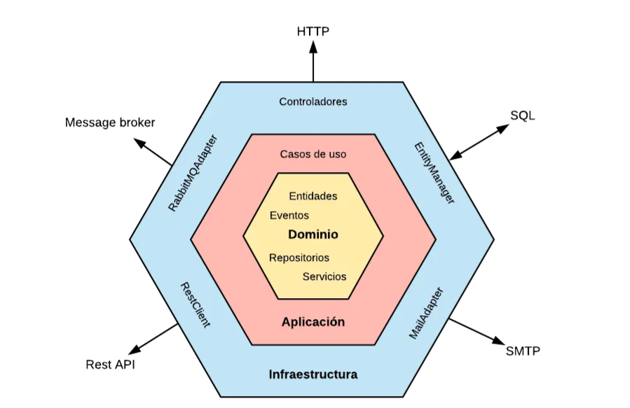

# NUVANTAPP

NUVANTAPP es un **Sistema de Ventas e Inventario** desarrollado con **Spring Boot**, enfocado en la **claridad**, **usabilidad** y **escalabilidad**, ideal para la gestión eficiente de productos, ventas y clientes.

---

## 🚀 Tecnologías

- Java 17+
- Spring Boot
- Spring Data JPA
- Spring Security
- PostgreSQL / MySQL
- Maven
- API REST

---

## 📦 Módulos del Sistema

### 1. Dashboard Principal

Muestra indicadores clave del negocio y accesos rápidos a los módulos principales.

**Indicadores:**

- Total de productos
- Productos con stock bajo
- Ventas del día
- Ventas del mes

---

### 2. Módulo de Gestión de Productos

**Pantallas:**

- Listado de productos
- Crear producto
- Editar producto
- Detalle de producto
- Reporte de stock de productos

**Campos del producto:**

- Código
- Nombre
- Descripción
- Categoría
- Precio de compra
- Precio de venta
- Stock
- Stock mínimo
- Código de barras
- Estado
- Unidad de medida
- Fecha de vencimiento
- Afecto a IGV
- Marca
- Proveedor

**Acciones:**

- Crear
- Editar
- Desactivar (eliminación lógica)
- Buscar por código o nombre
- Exportar reporte

---

### 3. Módulo de Ventas

**Pantallas:**

- Registro de venta
- Búsqueda de productos (nombre o código de barras)
- Detalle de venta
- Confirmación de venta

**Flujo de venta:**

1. Selección de productos
2. Ingreso de cantidades
3. Validación de stock
4. Cálculo de totales
5. Confirmación de venta

---

### 4. Módulo de Clientes

**Pantallas:**

- Listado de clientes
- Crear cliente
- Editar cliente
- Detalle de cliente

---

### 5. Módulo de Reportes

**Pantallas:**

- Reporte de stock
- Reporte de ventas por fecha
- Reporte de ventas por producto

---

### 6. Seguridad y Perfiles

El sistema cuenta con control de acceso basado en roles.

**Perfiles:**

- ADMIN
- USUARIO
- VENDEDOR

---

## 🔐 Seguridad

- Autenticación y autorización con Spring Security
- Control de acceso por perfiles
- Eliminación lógica de registros

---

## ⚙️ Arquitectura

NUVANTAPP está construido bajo el enfoque de **Arquitectura Hexagonal (Ports & Adapters)**, lo que permite un alto nivel de desacoplamiento, facilidad de pruebas y escalabilidad del sistema.

### Principios

- Separación clara entre la lógica de negocio y las tecnologías externas
- Independencia del framework (Spring Boot actúa como adaptador)
- Facilidad para cambiar bases de datos, interfaces o proveedores externos

### Capas principales

**Dominio**

- Contiene la lógica de negocio central
- Entidades, Value Objects y reglas del negocio
- No depende de frameworks ni de infraestructura

**Aplicación**

- Casos de uso del sistema
- Orquestación de la lógica de negocio
- Define los **puertos de entrada (Input Ports)**

**Puertos**

- Interfaces que definen cómo interactúa el dominio con el exterior
- Puertos de entrada (casos de uso)
- Puertos de salida (repositorios, servicios externos)

**Adaptadores**

- Implementaciones concretas de los puertos
- Adaptadores de entrada: REST Controllers
- Adaptadores de salida: JPA Repositories, servicios externos

**Infraestructura**

- Configuración técnica del proyecto
- Base de datos, seguridad, mensajería, configuración Spring

### Beneficios

- Código más mantenible y testeable
- Facilita pruebas unitarias sin dependencias externas
- Preparado para crecer y evolucionar sin afectar el núcleo del negocio

---

## 📄 Licencia

Proyecto de uso interno / académico / empresarial según necesidad.

---

**NUVANTAPP** – Gestión inteligente de ventas e inventario 💡
